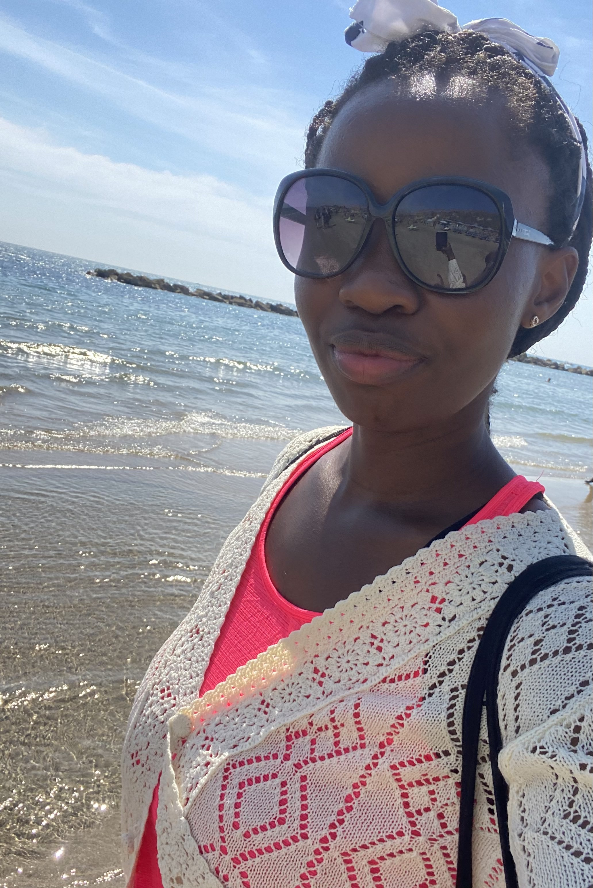
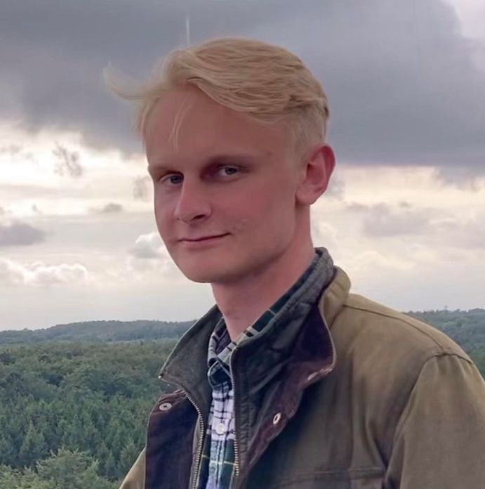
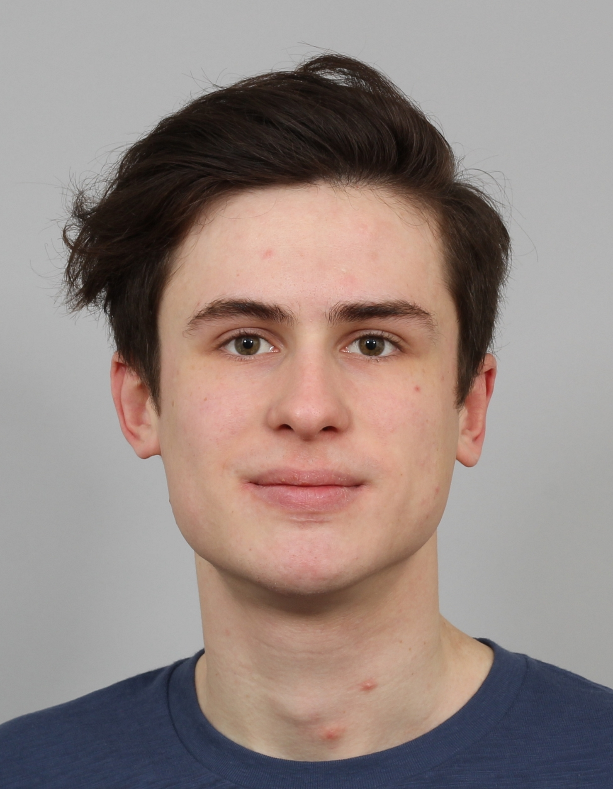

## James Elliott 

  

*Professor of Macromolecular Materials Science*

*Fellow, Tutor and Director of Studies in Natural Sciences (Fitzwilliam College)*

James Elliott is Professor of Macromolecular Materials in the University of Cambridge, where he carries out research on multiscale computational modelling of soft matter systems, including coarse-grained and molecular modelling of polymers, carbon nanotubes and their composites. He obtained his MA in Natural Sciences (Physics) from Cambridge, and his PhD in Polymer Physics at the University of Bristol. He was a JSPS Invitation Fellow and Visiting Professor at the University of Tokyo in 2008, and collaborates with several groups working on CNT synthesis and thermal properties of CNT-polymer composites.

*+44 (0)1223 335987*

*jae1001@cam.ac.uk*

<!-- ## Post-docs -->

## PhD students:

### [Conor Williams](https://conorwilliams.github.io/)

  

Hi! I started my PhD in 2020, my research is focused on developing off-lattice kinetic Monte Carlo methods to enable the simulation of solid-state systems into extended timescales. I'm a self-proclaimed C++ addict, you can find out about some of my projects on [GitHub](https://github.com/ConorWilliams).

### Ben Seddon

I started my PhD in 2019 as part of the CDT in Computational Methods for Materials Science. I'm trying to develop machine learned interatomic potentials for iron that take into account both the magnetic and spatial atomic degrees of freedom. This is important as the magnetic interactions affect iron's structural properties, for example by stabilising the room temperature phase. I've been using [constrained Density Functional Theory](https://pubs.acs.org/doi/10.1021/acs.jctc.2c00673) (cDFT) to generate the training data as this allows me to treat the atomic magnetic moments as inputs in the same way as the positions. 

### Patience Abugu

  

I had my undergraduate degree at the University of Nigeria, Nsukka, where I studied Pure and Industrial Chemistry. After this, I undertook an Erasmus Mundus joint master degree course in <a href="https://master-cne.eu/"> Chemical Nanoengineering </a> with semester rotations in France, Poland and Italy. My master thesis was based on the chemical functionalisation of nanosilica with aminosilane in supercritical carbon dioxide for the preparation of starch-nanosilica composites. My PhD at the University of Cambridge started in October 2022 and I am investigating cellulose nanofibers (CNF) from lignocellulosic biomass, their chemical modification and blends with other biomaterials such as proteins. Ultimately, the aim is to develop bio-based plastic materials with comparable mechanical and gas barrier properties to oil-based plastics used in food packaging. The bio-based plastics will have the added advantage of being biodegradable and/or compostable at the end of their useful life.

### Thomas Højlund-Dodd

  

Before arriving at Cambridge, I completed an MSc in the study of Energy Systems at the University of Oxford, where I wrote my thesis on the modelling of hybrid renewable energy systems and their integration with hydrogen electrolysers. This followed three years at the University of Manchester where I obtained my BSc in Environmental Science; specialising in the geochemical modelling of interactions between low-temperature fluids and high-strength rock. As part of Cambridge’s AI4ER CDT programme’s 2021 cohort, I finished my first-year MRes with a project on the optimisation of carbon mineralisation in basaltic rock using a sequence of reactive transport model simulation, gradient boosted decision tree emulation, and Bayesian optimisation. Moving from the Department of Earth Sciences to the Department of Materials Science and Metallurgy for my PhD, I currently study the potential for Bayesian optimisation to accelerate the development of sustainable properties in thermoset plastic materials. Current work is split between looking at improvements to recyclability as well as increasing the quantities of sustainably derived feedstocks used.

### Danny van der Haven

  

I currently study the compaction of pharmaceutical powders in close collaboration with Novo Nordisk. The majority of my work is computational, focusing on the use and development of numerical methods such as the finite element method (FEM) and discrete element method (DEM). I eventually hope to create a full-scale model of powder compaction that can be parameterised bottom-up by using single-particle data. Before my PhD, I completed the MPhil in Scientific Computing here in Cambridge. Before coming to Cambridge, I did a bachelors in Biomedical Engineering and a master's in Chemical Engineering at Eindhoven University of Technology, mainly focusing on soft matter physics and chemistry.

### Jokūbas Pelanskis

Hellooo! I started my PhD in 2022, my research focuses on mesoscale simulation of thin ionomer films using many-body dissipative particle dynamics. My project aims to improve our understanding of the catalyst layer, which is often manufactured from a thin layer of Nafion. Good understanding of the morphology might help to reduce the cost of the fuel cell by reducing the amount of expensive plattinum within the cell without sacrificing the effciency.

### Ghanshyam Hirani

  

Hola! Bonjour! Ciao! I started my PhD in 2020. My project investigates the reinforcing effects of adding graphene nanoplatlets (GNPs) to mechanically recycled polypropylene (rPP) as a method to ameliorate the effects of degradation and recover some of the properties relative to virgin PP (vPP), and provide a mechanistic understanding of the evolution of behaviour within the polymer matrix. Prior to this, I completed an MRes in Graphene Technology at the Department of Engineering here at Cambridge, focusing on the design and fabrication of non-invasive glucose monitoring for diabetes patients using novel graphene-based co-planar waveguide microsensors. I also researched sustainable production methods of multilayer graphene using cellulose nanocrystals in collaboration with the Department of Chemistry. Before Cambridge, I completed a BSc (Hons) in Chemistry and Biomedicine from King's College London. My 3rd year chemistry project looked into electrochemical energy conversion and storage, focusing on hydrogen fuel cells and batteries, and my 3rd year biomedicine project looked into the synthesis and in-vitro testing of various classes of transition metal anti-cancer drugs. I undertooked an MSc in Renewable Energy systems at UCL where I worked on the design and fabrication of ultra-low cost microbial fuel cells (MFCs) for simultaneous wastewater remediation and power generation. Following this, I worked as a visiting researcher at UCL's Department of Environmental Engineering specifically looking into microstructural control of low-cost MFC electrodes and ceramic membranes, and designed pilot scale models for wastewater remediation for implementation in rural Brazilian communities.
